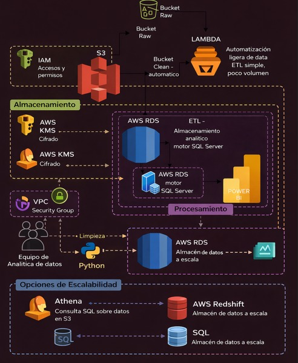

# Proyecto Integrador  
# NBA Roster Optimization  
## Modelo predictivo para la reducción de costos por inactividad y talento infravalorado

---

# Introducción y Problemática

En la NBA, cada selección del Draft representa una inversión financiera significativa. Sin embargo, no todos los jugadores logran consolidarse profesionalmente, generando pérdidas económicas para las franquicias.

Este proyecto tiene como objetivo desarrollar un modelo predictivo que permita optimizar la rentabilidad de los equipos mediante:

- La reducción de costos por jugadores con alta probabilidad de inactividad.
- La identificación de talento infravalorado con alto potencial de retorno de inversión (ROI).

Para garantizar resultados confiables, el análisis se limitó al periodo 2004–2023, debido a:

- La estandarización de la liga en 30 equipos.
- La consolidación del formato moderno del Draft.
- Mayor precisión en los registros de inactividad.
- Disponibilidad de métricas físicas avanzadas.

Esto permite construir un modelo alineado con las condiciones actuales del negocio.

---

# Uso de GitHub en el Proyecto

GitHub se utilizó como sistema de control de versiones y organización del proyecto.

El repositorio incluye:

- Datasets
- Procesos ETL
- Scripts en Python
- Análisis Exploratorio de Datos (EDA)
- Documentación del proyecto

Esto permitió:

- Organización estructurada
- Control de cambios
- Trazabilidad del desarrollo
- Trabajo reproducible

---

# Uso de Web Scraping

Se implementó web scraping mediante la API de Kaggle para automatizar la obtención de datos.

Beneficios:

- Eliminación de descargas manuales
- Datos actualizados automáticamente
- Reproducibilidad del proyecto
- Reducción de errores humanos

---

## Diagrama Entidad-Relación

Este diagrama representa la estructura relacional de las tablas utilizadas en el proyecto.

Permite entender cómo se conectan los datos de:

- Jugadores
- Draft
- Juegos
- Equipos
- Métricas de rendimiento

Es la base para el análisis y la construcción del modelo análitico.

  

## Flujo de Datos

El siguiente diagrama muestra la arquitectura de datos implementada en el proyecto, desde la obtención de los datos hasta su procesamiento y análisis.

  

### Descripción del flujo

El flujo sigue las siguientes etapas:

**1. Ingesta de datos**
- Obtención automatizada del dataset mediante la API de Kaggle
- Almacenamiento inicial en formato CSV

**2. Proceso ETL**
- Limpieza de datos con Python
- Transformación de variables
- Creación de métricas como ROI y rentabilidad

**3. Almacenamiento**
- Organización de datasets limpios en el repositorio
- Preparación para análisis y modelado

**4. Análisis**
- Exploratory Data Analysis (EDA)
- Identificación de patrones
- Construcción de variables predictivas

**5. Visualización**
- Creación de gráficos
- Generación de insights

Este flujo garantiza un proceso reproducible, estructurado y escalable.
---

# Análisis Exploratorio de Datos (EDA)

El análisis permitió identificar patrones clave:

## Rentabilidad de jugadores

Se definió como rentable:

- Jugadores con más de 5 temporadas
- Jugadores con más de 200 partidos

Hallazgos:

- La mayoría de jugadores no supera 5 temporadas
- Jugadores rentables tienen carreras significativamente más largas

---

## Picks del Draft

Hallazgo clave:

- Picks más altos tienen mayor probabilidad de éxito

Pero también:

- Mayor costo económico

Esto representa un riesgo financiero.

---

## Jugadores del Top 75

Solo:

- 1.13% de los jugadores pertenecen a este grupo

Esto confirma que el talento élite es escaso.

---

## Métricas de rendimiento

Se analizaron:

- Puntos
- Asistencias
- Tiros
- Participación

Estas métricas son fundamentales para evaluar ROI deportivo.

---

# Conclusiones

El proyecto confirma que el Draft representa una inversión de alto riesgo.

Hallazgos principales:

- Muchos jugadores no generan retorno
- La posición en el Draft influye en el éxito
- La duración de carrera es un indicador clave de ROI

El modelo desarrollado permitirá:

- Reducir pérdidas económicas
- Optimizar decisiones de contratación
- Identificar talento infravalorado

Esto proporciona una ventaja competitiva estratégica para las franquicias.

---
